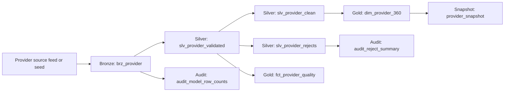

# Provider 360 Architecture

## Business Goal

Provider 360 creates a trusted, current, and auditable provider view for downstream analytics, network operations, credentialing, directories, compliance, and care management use cases.

The project starts with a simple provider feed, but the architecture is designed so more domains can be added later:

- Provider demographics
- Practice locations
- Specialties and taxonomy
- Credentialing status
- Contracts and network participation
- NPPES and external reference enrichment
- Claims-derived activity signals

## Medallion Design

### Bronze

Bronze keeps the data source-aligned. It does not apply heavy business rules. It standardizes basic types, uppercases controlled fields, and adds dbt metadata.

Primary model:

- `brz_provider`

Why this layer exists:

- Preserve source traceability.
- Keep raw file metadata: source system, source file name, source record number, ingestion timestamp.
- Give downstream layers one consistent model even if the raw landing mechanism changes later.

### Silver

Silver is the data quality and standardization layer. It cleans field formats, validates business-critical provider attributes, marks bad records, and separates accepted records from rejects.

Primary models:

- `slv_provider_validated`
- `slv_provider_clean`
- `slv_provider_rejects`

Key responsibilities:

- Strip non-numeric characters from NPI, TIN, phone, and ZIP.
- Validate NPI as 10 digits.
- Validate TIN as 9 digits.
- Validate provider type, state, ZIP, email, and network status.
- Build structured reject reasons as a PostgreSQL text array.
- Deduplicate accepted provider records by latest ingestion per NPI.

### Gold

Gold is business-consumable. It presents clean provider entities and quality metrics that are safe for reporting and downstream applications.

Primary models:

- `dim_provider_360`
- `fct_provider_quality`

Key responsibilities:

- Create the current Provider 360 dimension.
- Build the display name for individual vs organization providers.
- Expose file-level quality metrics including accepted records, rejected records, and reject rate.

### Audit

Audit models capture operational health and reconciliation metrics.

Primary models:

- `audit_model_row_counts`
- `audit_reject_summary`

Key responsibilities:

- Record row counts per model and dbt invocation.
- Summarize reject reasons by source system and source file.
- Support production monitoring, reconciliation, and data steward triage.

## Data Flow

## Enterprise Patterns Included

### Source Traceability

Every row carries:

- `source_system`
- `source_file_name`
- `source_record_number`
- `ingested_at`
- `bronze_record_key`

These columns make it possible to trace any gold record back to the exact source file and row.

### Reject Handling

Records are not silently dropped. Invalid rows are written to `slv_provider_rejects` with one or more reject reason codes.

Example reject reasons:

- `NPI_NULL`
- `NPI_NOT_10_DIGITS`
- `TIN_NULL`
- `TIN_NOT_9_DIGITS`
- `INVALID_EMAIL`
- `INVALID_PROVIDER_TYPE`

### Quality Gates

dbt tests enforce critical rules after transformations. Examples:

- `npi` not null and 10 digits.
- `tin` not null and 9 digits.
- Active NPI uniqueness.
- Provider display name not null.
- State and ZIP format checks.

### SCD2 History

The `provider_snapshot` snapshot tracks changes to key provider attributes over time. This supports historical reporting and audit questions such as, "What address or network status did this provider have last month?"

### Operational Alerting

PostgreSQL `pg_notify` is used as an alert handoff. dbt publishes run result payloads; a separate enterprise notification service listens and sends email.

This avoids hardcoding SMTP credentials or vendor-specific email APIs inside dbt transformations.

## Recommended Production Hardening

- Replace seed data with raw ingestion tables.
- Add `source freshness` checks once the raw tables exist.
- Add orchestration through Airflow, Dagster, dbt Cloud, GitHub Actions, or enterprise schedulers.
- Add row-level security or masking for sensitive provider attributes if required.
- Add domain-specific models for provider locations, contracts, affiliations, specialties, and credentialing.
- Persist dbt artifacts to object storage for lineage and audit review.
- Add blue/green or schema-based deployment for production releases.

